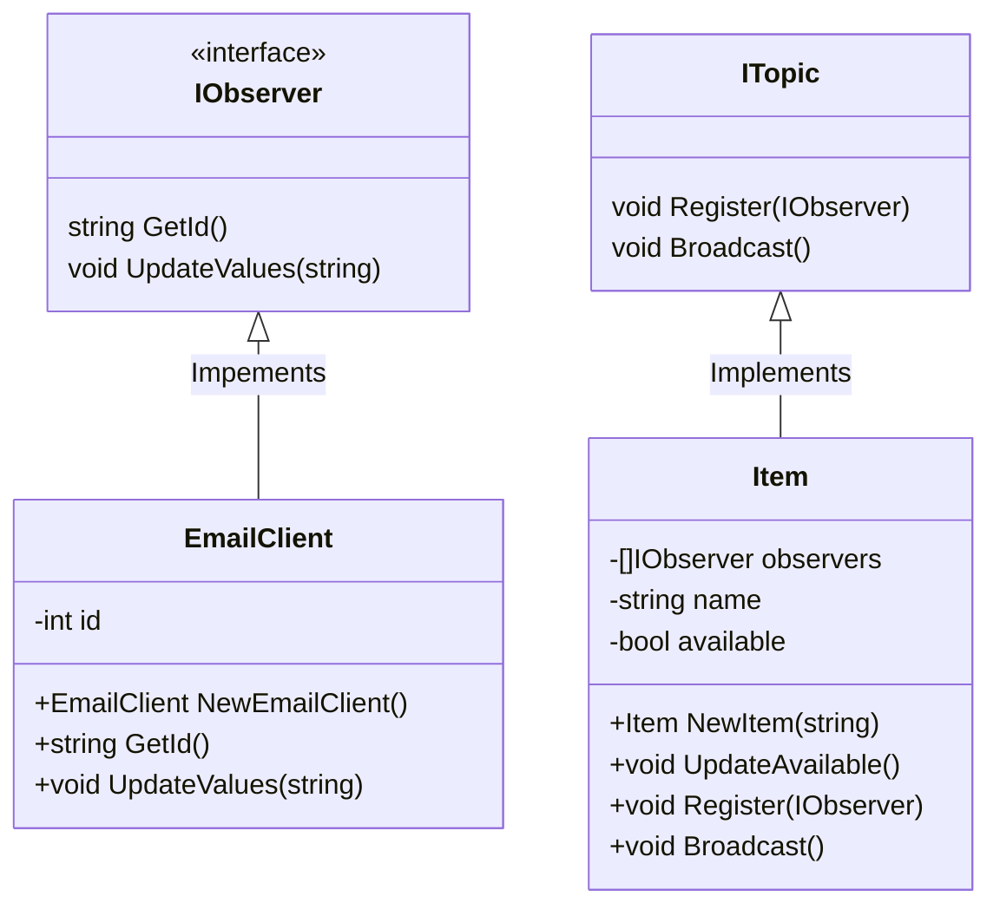

# 👀 Observer

---

Observer es un patrón de diseño de comportamiento que te permite definir un mecanismo de suscripción para notificar a varios objetos sobre cualquier evento que le suceda al objeto que están observando.

En esta practica realizamos la implementacion de este patron para notificar sin un producto esta disponible en stock o no
se realizo de manera programatica pero se puede implementar la misma logica agregando WebScrapper u otros metodos de busqueda de
informacion web.

En esencia se tiene un objeto al cual se estaran suscribiendo los observadores y este mismo objeto sera el que notificara
a los observadores cuando haya ocurrido un cambio; cuando esto ocurra los observadores ejecutaran la accion deseada.

La principal razon de implementar este patron es evitar la constante revision de la informacion por parte de los objetos suscritos 
a un event/informacion (en este patron llamado observadores); con este patron se evita la constate pregunta y sera el objeto el que
avise cuando es que ha cambiado.

