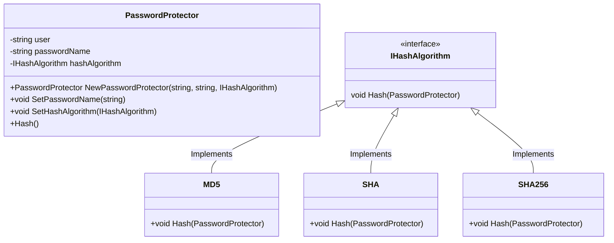

# 🏹 Strategy

---

Strategy es un patrón de diseño de comportamiento que te permite definir una familia de algoritmos, colocar cada uno de ellos en una clase separada y hacer sus objetos intercambiables.

En este caso se implemento una clase que permite intercambiar el algoritmo utilizado para encriptar una contraseña, esto se logra
debido a que todas las demas clases de encriptacion implementan la misma interfaz donde el metodo ```Hash()``` es implementado de 
manera independiente por cada una.

De modo que en nuestro codigo no llamaremos a ```HashMD5```, ```HashSHA```, ```HashXYZ``` sino que mediante el mismo metodo se manejaran 
todas las variantes.

Ademas es posible intercambiar el tipo de algoritmo de manera sencilla ya que unicamente habria que reasignar la clase del algoritmo
que se estara utilizando de la siguiente manera:

```go
import "project/algorithms"

func main(){
    pwdProtector.SetHashAlgorithm(&algorithms.XYZ{})
}
```


<br>
Diagrama UML:

