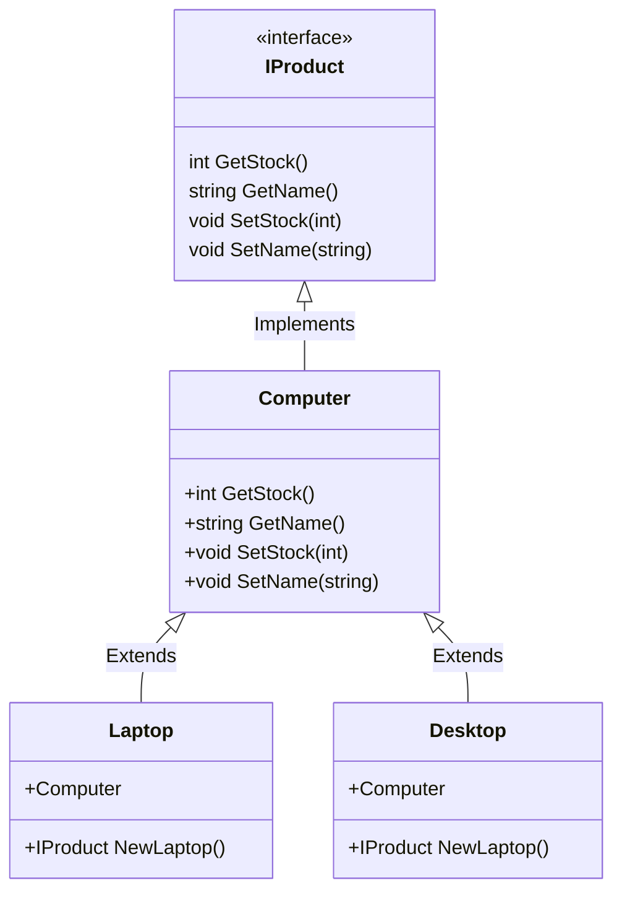
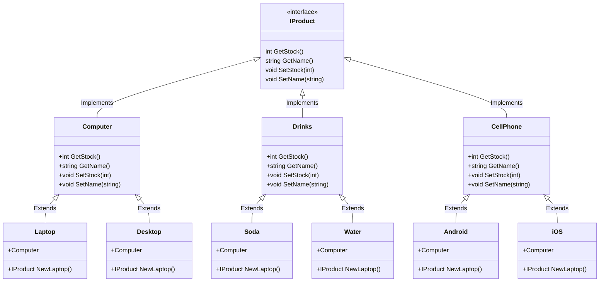

# 🏭 Factory Method

---

Este es un patrón de diseño creacional que proporciona una interfaz para crear objetos en una superclase, mientras permite a las subclases alterar el tipo de objetos que se crearán.

En esta practica realizamos la implementacion de este patron mediante la interfaz ```IProduct``` la cual contiene
todos los metodos necesarios para estandarizar los productos que se manejan durante la aplicacion.

De ahi se genero la struct ```Computer``` la cual implementa la interfaza ```IProduct``` y funciona como clase/struct padre
del resto de Structs (Productos) que se manejaran en la aplicacion.

Ademas de esto, se generaron los **Metodos de Fabrica** los cuales nos permiten crear objetos de distintas clases pero
permitiendonos crearlos y trabajar con ellos de una manera mas generica debido a que heredan de ```Computer```.


Diagrama de Clases para llevar a cabo este patron:


El uso de este patron de diseño nos permite estandarizar el manejo de los objetos de nuestra aplicacion aun y cuando estos
implementen la logica de distinta manera, podremos utilizar metodos genericos que podran manejarlos sin problema.

En caso de requerir agregar un nuevo objeto unicamente tendra que implementar la interfaz de ```IProduct``` y todos los metodos
de nuestra logica de negocio seran capaz de trabajar con estos nuevos objetos.

p.Ej.
En este diagrama aun y cuando tenemos varios tipos de productos completamente diferentes, todos implementan la misma interfaz por lo que 
su logica de negocio pueda ser diferente; en nuestra aplicacion todas se podran manejar bajo el mismo metodo ya que cada una
de las estructuras se encarga de implementar su logica y nosotros no nos preocuparemos si el stock se mide por caja, botella, paquete, etc.Ñ
