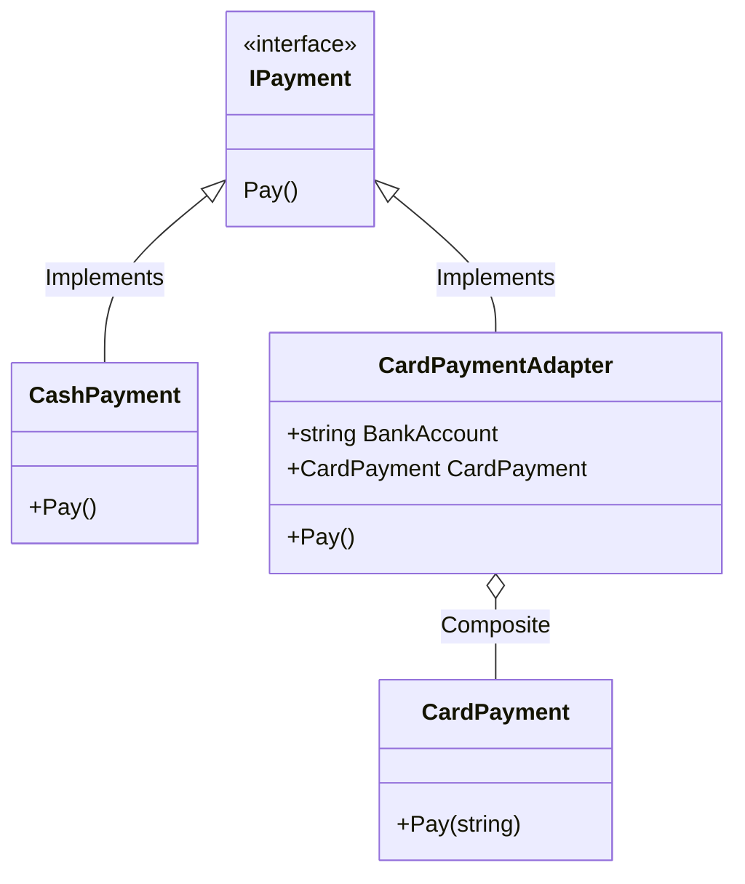

# 🧬 Adapter

---

Adapter es un patrón de diseño estructural que permite la colaboración entre objetos con interfaces incompatibles.

En este caso se cuenta con dos metodos de pago (efectivo y tarjeta) pero cada uno implementa su metodo de manera diferente,
por lo que no terminan de cumplir todos con el contrato de la interfaz y se convierte en una tarea lograr encajar todo en un metodo
generico de objetos que implementen el contrato de manera satisfactoria.

El metodo de pago con tarjeta tiene la desventaja de requerir mas parametros de los que dicta el contrato de la interfaz por lo que
no es candidato para nuestro metodo generico.

La solucion es generar una nueva struct que si implemente de manera correcta el contrato pero que a su vez permita manejar la logica
del pago con tarjeta; esto se logra manejando la construccion del metodo llamando al metodo de pago con tarjeta y agregando esos paramentros extra
de una manera distinta (en este caso en la construccion del objeto adaptador).

Al final nos queda una clase ```CardPaymentAdapter``` que entre sus propiedades se encuentra un objeto ```CardPayment``` 
el cual es usado para manejar la logica de pago de tarjeta mientras que el adaptador maneja la comunicacion con el metodo.


